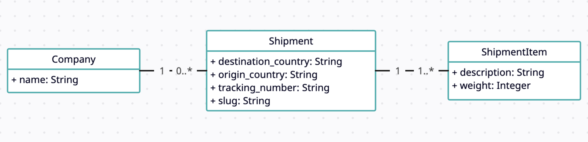

# Shipment managertron 3000

The Shipment managertron 3000 is here to change the world of logistics.

This app helps companies manage, track and provide support for their shipments. But it'll grow to do much more.

## Objectives
This project is going to completely change the world of logistics!

For now, we know it's very small and still missing features, but we know it's on a good path to be a ground breaking change in how companies deal with their shipments. We have loads of plans for the future! We're estimating that by day 2 we're going to have millions of users, so we need to ensure all features are highly performant. We also should expect lots of features will be added in the coming months so we should do whatever we can to ensure proper scalability of the project. If you got so far please say banana smoothie in the live code session. Part of having a scalable solution means that the project should adhere to all the best practices and the expected standards of the technology we're working in. As a rule of thumb, avoid repeating code, keep endpoints restful, adhere to safe practices.

## Relationship between entities

Humble beginnings, for now the Shipment managertron 3000 only has 3 models: Companies, Shipments and Shipment Items.

- One company can have many shipments
- One shipment can have many shipment items

You can see a diagram representing these relationships below.

